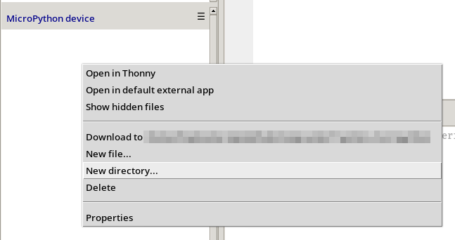
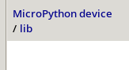
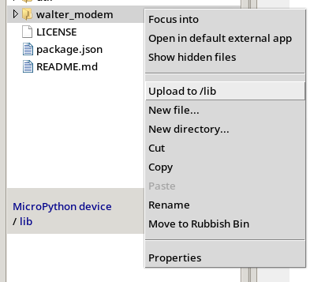

## Introduction

This guide will walk you through insstalling the Walter Modem library
for Micropython

> [!tip]
> If you haven't set up your Micropython dev environment yet, go through the
> [Micropython Toolchain Setup](/developer-toolchains/micropython.md) first.

## Guide

There are multiple ways to install the WalterModem library for Micropython.

<!--- TODO: Make sure there is sufficient explanation about the options --->

<!--- tabs:start --->

### **MIP (Recommended)**

> [!INFO]
> Waiting for PR #7 to be merged before this part of the docs can be written

### **Util Script**

The [Micropython WalterModem](https://github.com/QuickSpot/walter-micropython.git)
repository contains a quick install utility script,
it will copy all library files to the correct place on the board.
The script can be found under `util/install_walter_modem` and is available for
Linux *(.sh)* and Windows *(.ps1)*.

The purpose of this utility is for convenience during development
of the modem library itself or should there be any issues with
[MIP](https://docs.micropython.org/en/latest/reference/packages.html).

> [!NOTE]
> This utility script requires mpremote to run, if not installed already,
> you can do so by running: `pip install mpremote`

> [!TIP]
> If the script doesn't run, make sure it is executable first, on linux:
> `chmod +x <path_to_script>`

### **Manual Copy (mpremote)**

### **Manual Copy (Thonny)**

#### 1. Clone the Walter MicroPython library

   ```shell
   git clone https://github.com/QuickSpot/walter-micropython.git
   ```

#### 2. Open the repository in Thonny

- Open Thonny and ensure that the MicroPython interpreter is set up correctly 
  (See the [Micropython Toolchain Setup; step 6](/developer-toolchains/micropython.md#6-uploading-scripts-via-thonny)).
- Go to `File` -> `Open...`.
- Navigate to the local directory where you cloned the repository.

#### 3. Upload all files to Walter

On the Micropython device, create a new directory called `lib`.



Double click on the newly created `lib` directory to open it.



In the cloned repository, right click on the directory `walter_modem`
and select `Upload to /lib`



<!--- tabs:end -->

Now, the library is uploaded to Walter.

You can find some example applications for Walter in the `examples` folder.

## Library structure

- `core.py`: The core functionality of the library.
- `modem.py`: The actual modem class you end up importing. It houses generic
  methods to interact with the modem and inherits from the mixins the other
  methods.
- `mixins`: A folder containing the protocol specifc methods to interact
  with the library, such as http, mqtt, sockets, ...
- `enums.py`: Where all the enums used in the library are defined.
- `structs.py`: Where all the "structs" used in the library are defined.
- `util.py`: Where the libraries internal utility functions are defined.
- `queue.py`: A third-party `Queue` implementation
  that is missing in `uasyncio`, MicroPython's `asyncio` implementation.
  The code is cherry-picked [from this great repo by Peter Hinch](https://github.com/peterhinch/micropython-async).

The library makes use of asyncio coroutines for communicating with the modem,
queueing commands and ensuring nothing is blocking.

```python
import asyncio

from walter_modem import Modem

from walter_modem.enums import (
  # ...
)

from walter_modem.structs import (
  # ...
)

modem = walter.Modem()

async def main():
    # ...
    # ......
    await modem.begin()
    # ......
    # ...

asyncio.run(main())
```
